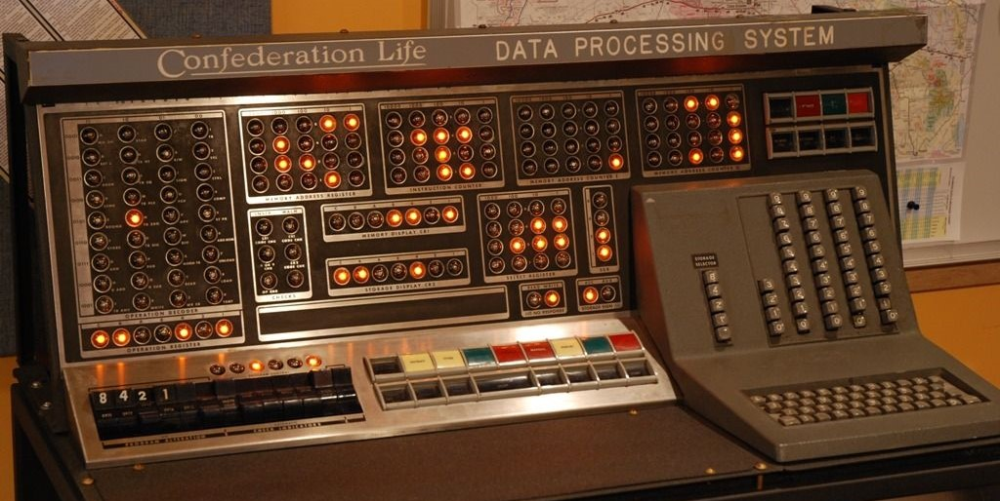

# Project705 - IBM 705 mainframe emulator

Trying to build the most realistic emulator of a vacuum tube mainframe in existence. Oh, and building a working physical replica of a groovy 1950's console.

## Why?

I'm a programmer who has spent a lot of time looking for some interactive furniture for my apartment, eventually stumbling on a picture of an IBM 705 console. And what a *beast* it is. Best of all, it's not too intimating, remarkably easy to understand and has plenty of buttons and switches, while the large incandescent indicators give off a soft 1950's glow instead of a harsh light.

It's the sort of thing that'll spark conversation no matter the occasion, easy to explain without getting technical and its soft flickering lights create a sensation of a camp fire at night, gently twinkling away.

Most importantly however, I'll be something to brighten the day of my little nieces when they come to visit, who've love the lights, buttons and switches.

## The machine
The goal is to emulate a complete IBM 705 II installation as it appeared in 1958. This includes the processor and the devices it.

Only the console and possibly the console typewriter are intended to physically built.

The list of devices to be emulated are:

* 705 II CPU, with 40,000 characters of memory
* 714 Card Reader
* 722 Card Punch
* 727 Magnetic tape units
* 734 Magnetic Drum Storage
* 782 Console and Typewriter
* 760 Record Storage and Control
* 730 Printer
* 717 Printer

Where a device has a control unit, the control unit is also emulated.

## Compatibility
The emulator and its associated tools are developed as a modern .Net application and so should be compatible across all major operating systems. Only Windows 11 is currently tested, this is a personal project after all.

## Contributing
This is a personal project for now so contributions aren't currently accepted.

## License
This project, its tools and documentation are all under GPLv3. Third party documentation and photographs remain under their original licenses.